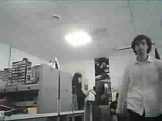

# Small Rocket – Image Transmission via LoRa (ESP32-CAM + MKRWAN):

## 📖 Overview
This project demonstrates **long-range image transmission** for a small experimental rocket, using an **ESP32-CAM** for image capture and an **Arduino MKR WAN 1300** for LoRa-based transmission and reception.  
Instead of a live video stream (impossible with LoRa’s low bandwidth), the system captures **JPEG snapshots** and sends them to the ground station over **434 MHz LoRa** using fragmentation. My teammate and I developed this project as part of the EIRSPACE association team. It was carried out as a thematical project during our second year (equivalent to a Master 1) at ENSEIRB-MATMECA, an engineering school in Bordeaux, France.”

## ⚙️ Hardware
- **ESP32-CAM** (AI Thinker) – captures images in CIF resolution (JPEG, medium quality).  
- **MKR WAN 1300 (TX)** – receives the JPEG buffer from ESP32-CAM over UART and transmits via LoRa.  
- **MKR WAN 1300 (RX)** – receives image fragments via LoRa and reconstructs the JPEG.  
- **LoRa antennas** (434 MHz, U.FL connector).  
- **PC** for image reconstruction and visualization.

## 🔗 System Architecture
1. **ESP32-CAM** captures an image → sends raw JPEG buffer over **UART**.  
2. **MKR WAN (TX)** fragments the image into **255-byte packets** → transmits them via **LoRa 434 MHz**.  
3. **MKR WAN (RX)** receives the fragments → reassembles the JPEG → forwards to PC via **Serial USB**.  
4. **Python post-processing** filters duplicates and saves the received buffer as a `.jpg` file. (The python code is not included in this project but you can easily write a simple python code " hex -> .JPEG " 

## 📡 Transmission Settings
- **Frequency:** 434 MHz  
- **Packet size:** 255 bytes (LoRa limit)  
- **Inter-packet delay:** ~200–400 ms (adjusted to avoid losses & comply with duty cycle we had to increase this delay because we did not receive the whole image packet in one period and MkR WAN would start sending the second one before the first one is fully sent).  
- **Throughput:** ~30–40 s per image.  

## 📂 Repository Contents
- `ESP32_TX.ino` → Code for ESP32-CAM (capture + UART transfer).  
- `MKRWAN_TX.ino` → Code for MKR WAN (transmitter – fragmentation + LoRa send).  
- `MKRWAN_RX.ino` → Code for MKR WAN (receiver – reassembly + Serial output).  
  

## 🚀 Results
- Successfully transmitted JPEG snapshots over **>1 km range**.

- First valid images reconstructed after tuning inter-packet delays.  
- Reliability >95% with optimized settings.  

## 👥 Authors
- Fatimazahra El Meady  
- Anass El Kabbaj  
(ENSEIRB-MATMECA, EIRSPACE 2025)

