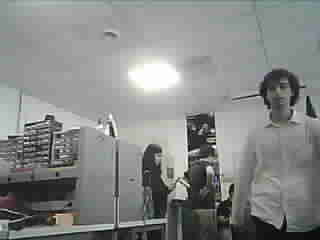

# Small Rocket – Image Transmission (LoRa 434 MHz)

This project demonstrates **image transmission** for a small experimental rocket, using an **ESP32-CAM** for image capture and **Arduino MKR WAN 1300** for LoRa-based transmission and reception.  
Instead of a live video stream, the system captures **JPEG snapshots** and sends them as **255-byte fragments** over **434 MHz** LoRa.

> 🔗 Full code & docs live in this repository on GitHub.

## Quick Links
- 📄 **Project README**: [README.md](./README.md)
- 📷 **ESP32-CAM (Capture + UART TX)**: [`ESP32_TX.ino`](./ESP32_TX.ino)
- 📡 **MKR WAN (LoRa Transmitter)**: [`MKRWAN_TX.ino`](./MKRWAN_TX.ino)
- 📥 **MKR WAN (LoRa Receiver)**: [`MKRWAN_RX.ino`](./MKRWAN_RX.ino)

**Key settings**
- Frequency: **434 MHz**
- Packet size: **255 bytes**
- Inter-packet delay: **~200–400 ms** (tuned to reduce losses and respect duty-cycle)
- Typical time per image: **~30–40 s**

## Results
- Successful reception and reconstruction of JPEG snapshots
- Reliability **80%** after tuning delays and filtering duplicates

## Team & Context
My teammate and I developed this project as part of the **EIRSPACE** association team.  
It was carried out as a **thematical project** during our **second year (Master 1 equivalent)** at **ENSEIRB-MATMECA** (Bordeaux, France).

## Contact / Credits
- **Authors:** Fatimazahra El Meady, Anass El Kabbaj  
- **Association:** EIRSPACE – C’Space 2025

